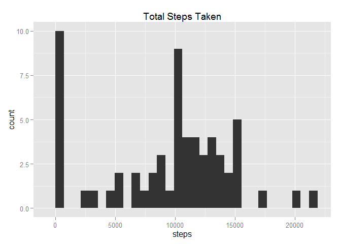
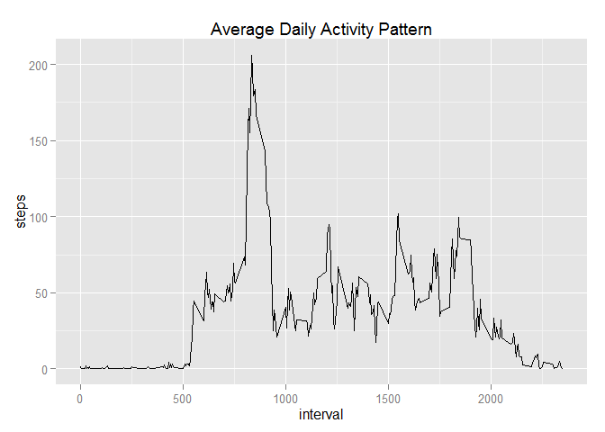
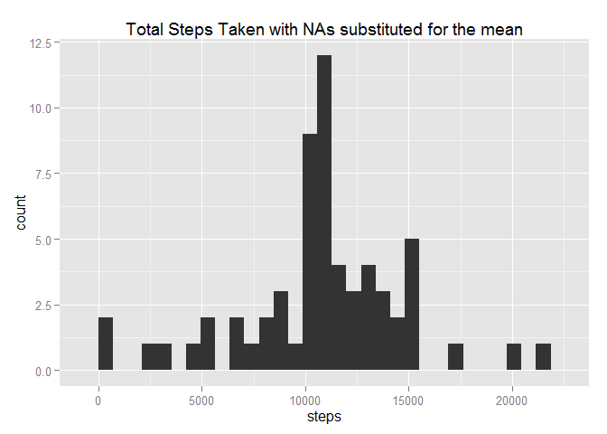
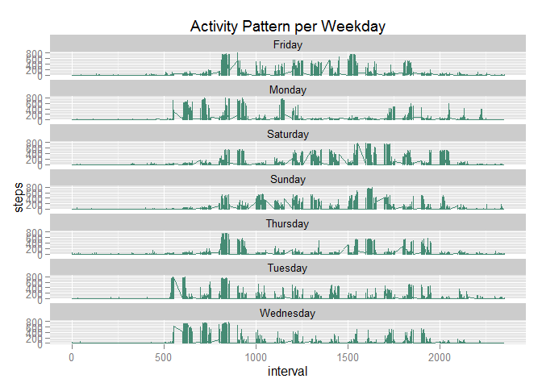
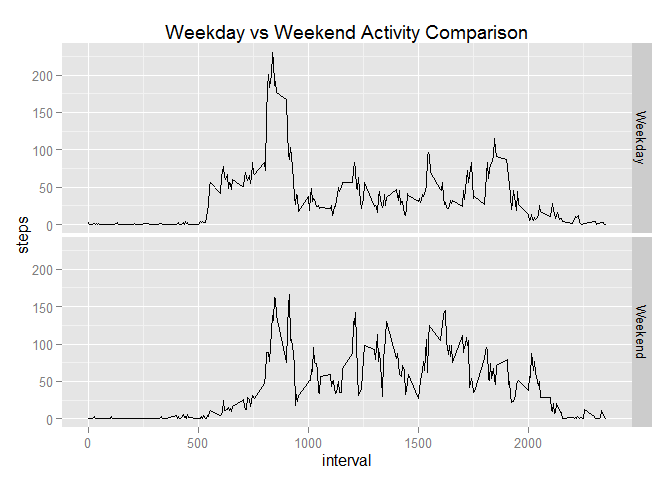
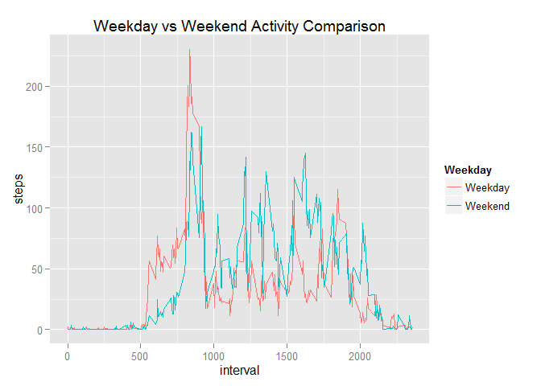

# Reproducible Research: Peer Assessment 1
This report summarises the activity data collected from an anonymous individual over the course of two months.

## Loading and preprocessing the data

```r
RawData<- read.csv("activity.csv",header = TRUE)
```
The date data is of the "factor" class. To make things a bit easier I am going to change the class to "Date".


```r
RawData$date<-as.Date(RawData$date)
```


## What is mean total number of steps taken per day?  
To answer this I used the "group_by()" and "summarise_each()" functions to create a data frame with the sum of the steps by date.
I then used the ggplot2 system to create a histogram of the data.


```r
library(ggplot2)
library(dplyr)
```

```
## 
## Attaching package: 'dplyr'
## 
## The following objects are masked from 'package:stats':
## 
##     filter, lag
## 
## The following objects are masked from 'package:base':
## 
##     intersect, setdiff, setequal, union
```

```r
DailyStepTotal<-summarise_each(group_by(RawData,date),funs(sum(steps,na.rm = TRUE)))

HistStepsPerDay<-ggplot(data = DailyStepTotal, aes(steps)) + geom_histogram()+
    ggtitle("Total Steps Taken")
    

print(HistStepsPerDay)
```

```
## stat_bin: binwidth defaulted to range/30. Use 'binwidth = x' to adjust this.
```

 

Looks like the most frequent amount of steps taken was in the 10,000 and 0 regions. It looks like the NAs in the data are being treated as 0 when plotting. Lets have a look at the mean and median.


```r
mean(DailyStepTotal$steps)
```

```
## [1] 9354.23
```

```r
median(DailyStepTotal$steps)
```

```
## [1] 10395
```

## What is the average daily activity pattern?

To answer this I created a data frame with the mean steps per interval and plotted it.

```r
MeanStepsPerInterval<-summarise_each(group_by(RawData,interval),funs(mean(steps,na.rm = TRUE)))

plotMeanIntervalPattern<-ggplot(data = MeanStepsPerInterval, aes(interval,steps)) +
    geom_line()+
    ggtitle("Average Daily Activity Pattern")
    

print(plotMeanIntervalPattern)
```

 

Looks like the subject does some jogging in the morning and is then walking fairly consitently throughout the day.
Which interval has the most activity?  

```r
MostActiveInterval<-MeanStepsPerInterval[MeanStepsPerInterval$steps==max(MeanStepsPerInterval$steps),1]
MostActiveInterval
```

```
## Source: local data frame [1 x 1]
## 
##   interval
## 1      835
```
The most active interval was 835. At ~200 steps in 5min it means the subject goes for a jog in the morning or he realises that he is running late for work most mornings.

## Imputing missing values
How many NAs are in the data set?

```r
sum(is.na(RawData$steps)) 
```

```
## [1] 2304
```

I decided to fill in the NAs with the values from the mean activity curve worked out previously.

```r
RawDataMinusNAs<-RawData
NALocations<-is.na(RawData$steps)

RawDataMinusNAs$steps<-replace(RawData$steps,NALocations,MeanStepsPerInterval$steps)

ModifiedDailyStepTotal<-summarise_each(group_by(RawDataMinusNAs,date),funs(sum(steps,na.rm = TRUE)))

ModifiedHistStepsPerDay<-ggplot(data = ModifiedDailyStepTotal, aes(steps)) + geom_histogram()+
    ggtitle("Total Steps Taken with NAs substituted for the mean")
    

print(ModifiedHistStepsPerDay)
```

```
## stat_bin: binwidth defaulted to range/30. Use 'binwidth = x' to adjust this.
```

 

Removing the NAs and replacing them with the mean value for that interval significantly decreased the 0 step peak. Lets have another look at the mean and median.


```r
mean(ModifiedDailyStepTotal$steps)
```

```
## [1] 10766.19
```

```r
median(ModifiedDailyStepTotal$steps)
```

```
## [1] 10766.19
```

A median of 10,000 steps a is fairly impressive, the subject must have a job that involves walking as well as jogging on a regular basis.

## Are there differences in activity patterns between weekdays and weekends?

Lets have a quick look at the patterns across each day.


```r
RawDataMinusNAs$Weekday<-weekdays(RawDataMinusNAs$date)

ggplot(RawDataMinusNAs,aes(interval,steps))+geom_line(color="aquamarine4")+facet_wrap(~Weekday, ncol = 1)+ggtitle("Activity Pattern per Weekday")
```

 

There isn't as much early morning activity on Saturday, Sunday and Thursday. Lets combine the data into Weekday and Weekend categories.


```r
#If you know a better way of doing this please let me know.
WeekdayData<-RawDataMinusNAs[RawDataMinusNAs$Weekday=="Monday" |
                                 RawDataMinusNAs$Weekday=="Tuesday" |
                                 RawDataMinusNAs$Weekday=="Wednesday" |
                                 RawDataMinusNAs$Weekday=="Thursday" |
                                 RawDataMinusNAs$Weekday=="Friday",]

WeekendData<-RawDataMinusNAs[RawDataMinusNAs$Weekday=="Sunday" |
                                 RawDataMinusNAs$Weekday=="Saturday",]

MeanWeekdayData<-summarise_each(group_by(WeekdayData,interval),funs(mean(steps)))

MeanWeekendData<-summarise_each(group_by(WeekendData,interval),funs(mean(steps)))

MeanWeekendData$Weekday<-"Weekend"
MeanWeekdayData$Weekday<-"Weekday"

MeanDayComparisonData<-rbind(MeanWeekendData,MeanWeekdayData)


p4<-ggplot(MeanDayComparisonData,aes(interval,steps))+
    geom_line()+
    facet_grid(Weekday ~.)+
    ggtitle("Weekday vs Weekend Activity Comparison")
p4
```

 

The main difference difference seems to be that their is more early morning activity on Weekdays and more late activity on Weekends. Lets overlap the plots and have another look.


```r
WeekdayComparisionPlot<-ggplot(MeanDayComparisonData,aes(interval,steps,color=Weekday))+geom_line()+
    ggtitle("Weekday vs Weekend Activity Comparison")
WeekdayComparisionPlot
```

 


```r
TotalStepsByWeekday<-summarise_each(group_by(MeanDayComparisonData,Weekday),funs(sum(steps)))

TotalStepsByWeekday[,c(1,3)]
```

```
## Source: local data frame [2 x 2]
## 
##   Weekday    steps
## 1 Weekday 10255.85
## 2 Weekend 12201.52
```

Overall the subject is more active on the weekend then he is during the week.


