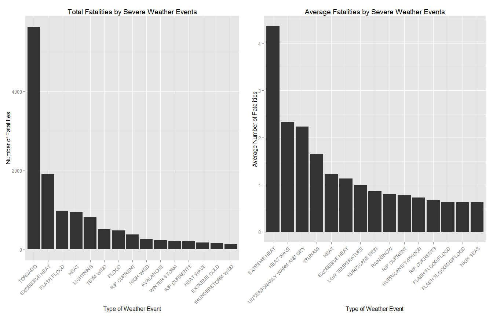
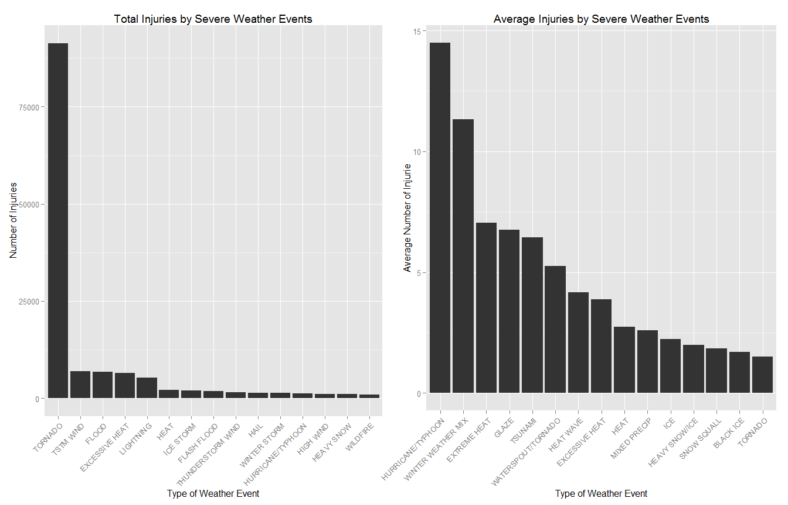
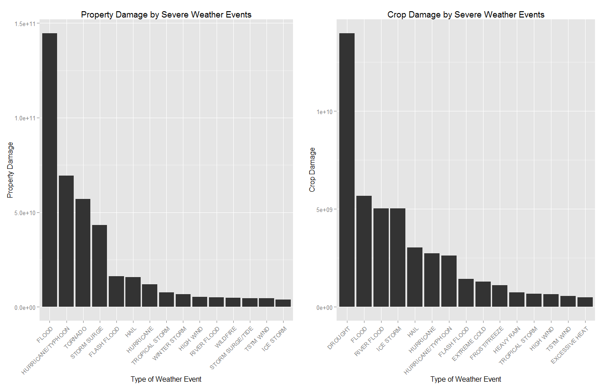

# NOAA Storm Database Analysis

##Synopsis
Using the U.S. National Oceanic and Atmospheric Administrations (NOAA) database, the impact of various weather events on human and economic health was analysed. The data showed that tornados had the biggest impact on human health and that floods had the biggest impact on economic health.

##Data Processing

This loads all the required packages.

```r
library(R.utils)
library(dplyr)
library(ggplot2)
library(gridExtra)
library(grid)
```

This checks to see if the compressed data file is in the working directory. If it isn't, it will download the file and decompress it.

```r
if (!"repdata-data-StormData.csv.bz2" %in% list.files()) {
    print("Downloading file")
    download.file("https://d396qusza40orc.cloudfront.net/repdata%2Fdata%2FStormData.csv.bz2", destfile = "repdata-data-StormData.csv.bz2")
    bunzip2("repdata-data-StormData.csv.bz2", overwrite=T, remove=F)
}
```

This will read the data into R. The file is quite large so this might take a little while.

```r
RawData<-read.csv("repdata-data-StormData.csv")
```

##Analysis


###Across the United States, which types of events are most harmful with respect to population health?

The event type is described by the EVTYPE variable. However not a lot of discipline was used when categorising the event into a category. This resulted in 985 unique event categories many of which are the same just with a different name. I decided to remove event types that have 5 or less Occurrences, in order to remove the one off events and events that are likely due to improper labelling.


```r
DeathData<-summarise(group_by(RawData,EVTYPE),
                     TotalDeath = sum(FATALITIES,na.rm = TRUE),
                     MeanDeath = mean(FATALITIES,na.rm = TRUE),
                     SDDeath = sd(FATALITIES,na.rm = TRUE),
                     Occurrences=n())

InjurieData<-summarise(group_by(RawData,EVTYPE),
                     TotalInjurie = sum(INJURIES,na.rm = TRUE),
                     MeanInjurie = mean(INJURIES,na.rm = TRUE),
                     SDInjurie = sd(INJURIES,na.rm = TRUE),
                     Occurrences=n())


DeathData<-filter(DeathData,Occurrences>=5)
InjurieData<-filter(InjurieData,Occurrences>=5)

Top15Death<-arrange(DeathData,desc(TotalDeath))[1:15,1:2]
Top15DeathMean<-arrange(DeathData,desc(MeanDeath))[1:15,c(1,3)]

Top15Injurie<-arrange(InjurieData,desc(TotalInjurie))[1:15,1:2]
Top15InjurieMean<-arrange(InjurieData,desc(MeanInjurie))[1:15,c(1,3)]

p1<-ggplot(Top15Death, aes(x=reorder(EVTYPE,-TotalDeath), y=TotalDeath)) + 
        geom_bar(stat="identity")+
        ylab("Number of Fatalities")+
        xlab("Type of Weather Event")+
        theme(axis.text.x = element_text(angle = 45,hjust = 1))+
        ggtitle("Total Fatalities by Severe Weather Events")

p2<-ggplot(Top15DeathMean, aes(x=reorder(EVTYPE,-MeanDeath), y=MeanDeath)) + 
        geom_bar(stat="identity")+
        ylab("Average Number of Fatalities")+
        xlab("Type of Weather Event")+
        theme(axis.text.x = element_text(angle = 45,hjust = 1))+
        ggtitle("Average Fatalities by Severe Weather Events")

p3<-ggplot(Top15Injurie, aes(x=reorder(EVTYPE,-TotalInjurie), y=TotalInjurie))         + geom_bar(stat="identity")+
        ylab("Number of Injuries")+
        xlab("Type of Weather Event")+
        theme(axis.text.x = element_text(angle = 45,hjust = 1))+
        ggtitle("Total Injuries by Severe Weather Events")

p4<-ggplot(Top15InjurieMean, aes(x=reorder(EVTYPE,-MeanInjurie),y=MeanInjurie))         + geom_bar(stat="identity")+
        ylab("Average Number of Injurie")+
        xlab("Type of Weather Event")+
        theme(axis.text.x = element_text(angle = 45,hjust = 1))+
        ggtitle("Average Injuries by Severe Weather Events")
```


###Across the United States, which types of events have the greatest economic consequences?

For some perplexing reason, the property damage and crop damage data has been put in terms of a value and a multiplier. First step will be to convert that into a useable number. Then the same procedures used on the health data was used.

```r
HPropData<-RawData[RawData$PROPDMGEXP=="H",]
HPropData$PropDamage<-HPropData$PROPDMG*10^2

KPropData<-RawData[RawData$PROPDMGEXP=="K",]
KPropData$PropDamage<-KPropData$PROPDMG*10^3

MPropData<-RawData[RawData$PROPDMGEXP=="M",]
MPropData$PropDamage<-MPropData$PROPDMG*10^6

BPropData<-RawData[RawData$PROPDMGEXP=="B",]
BPropData$PropDamage<-BPropData$PROPDMG*10^9

PropDamData<-rbind(HPropData,KPropData,MPropData,BPropData)
remove(HPropData,KPropData,MPropData,BPropData)


HCropData<-RawData[RawData$CROPDMGEXP=="H",]
HCropData$CropDamage<-HCropData$CROPDMG*10^2
 
KCropData<-RawData[RawData$CROPDMGEXP=="K",]
KCropData$CropDamage<-KCropData$CROPDMG*10^3

MCropData<-RawData[RawData$CROPDMGEXP=="M",]
MCropData$CropDamage<-MCropData$CROPDMG*10^6

BCropData<-RawData[RawData$CROPDMGEXP=="B",]
BCropData$CropDamage<-BCropData$CROPDMG*10^9

CropDamData<-rbind(HCropData,KCropData,MCropData,BCropData)
remove(HCropData,KCropData,MCropData,BCropData)

SummarisedPropDamData<-summarise(group_by(PropDamData,EVTYPE),
                        TotalPropDam = sum(PropDamage,na.rm = TRUE),
                        MeanPropDamage = mean(PropDamage,na.rm = TRUE),
                        SDPropDamage = sd(PropDamage,na.rm = TRUE),
                        Occurrences=n())


SummarisedCropDamData<-summarise(group_by(CropDamData,EVTYPE),
                        TotalCropDam = sum(CropDamage,na.rm = TRUE),
                        MeanCropDamage = mean(CropDamage,na.rm = TRUE),
                        SDCropDamage = sd(CropDamage,na.rm = TRUE),
                        Occurrences=n())

SummarisedPropDamData<-filter(SummarisedPropDamData,Occurrences>=5)
SummarisedCropDamData<-filter(SummarisedCropDamData,Occurrences>=5)

Top15PropDamage<-arrange(SummarisedPropDamData,desc(TotalPropDam))[1:15,c(1,2,5)]
Top15PropDamageMean<-arrange(SummarisedPropDamData,desc(MeanPropDamage))[1:15,c(1,3)]

Top15CropDamage<-arrange(SummarisedCropDamData,desc(TotalCropDam))[1:15,c(1,2,5)]
Top15CropDamageMean<-arrange(SummarisedCropDamData,desc(MeanCropDamage))[1:15,c(1,3)]


p5<-ggplot(Top15PropDamage, aes(x=reorder(EVTYPE,-TotalPropDam), y=TotalPropDam)) + 
        geom_bar(stat="identity")+
        ylab("Property Damage")+
        xlab("Type of Weather Event")+
        theme(axis.text.x = element_text(angle = 45,hjust = 1))+
        ggtitle("Property Damage by Severe Weather Events")

             
# p6<-ggplot(Top15PropDamageMean, aes(x=reorder(EVTYPE,-MeanPropDamage), y=MeanPropDamage)) + 
#         geom_bar(stat="identity")+
#         ylab("Average Property Damage")+
#         xlab("Type of Weather Event")+
#         theme(axis.text.x = element_text(angle = 45,hjust = 1))+
#         ggtitle("Average Property Damage by Severe Weather Events")


p7<-ggplot(Top15CropDamage, aes(x=reorder(EVTYPE,-TotalCropDam), y=TotalCropDam)) + 
        geom_bar(stat="identity")+
        ylab("Crop Damage")+
        xlab("Type of Weather Event")+
        theme(axis.text.x = element_text(angle = 45,hjust = 1))+
        ggtitle("Crop Damage by Severe Weather Events")


# p8<-ggplot(Top15CropDamageMean, aes(x=reorder(EVTYPE,-MeanCropDamage), y=MeanCropDamage)) + 
#         geom_bar(stat="identity")+
#         ylab("Average Crop Damage")+
#         xlab("Type of Weather Event")+
#         theme(axis.text.x = element_text(angle = 45,hjust = 1))+
#         ggtitle("Average Crop Damage by Severe Weather Events")
```

##Results


```r
grid.arrange(p1,p2,ncol=2)
```

 


```r
grid.arrange(p3,p4,ncol=2)
```

 

The above graphs show that in terms of total fatalities and injuries, tornados are the most harmful weather event by far. However this is aided by the fact that tornados are the fourth most common weather event recorded. In terms of average fatalities and injuries per event, the heat related events such as "Extreme Heat" and "Heat Wave" are significantly more deadly than tornados. 

I suspect that spending some money on basic heat stress education would be a cheap way of reducing fatalities/Injuries. Especially compared to building bunkers everywhere in order to drop the tornado fatality/injury rate.


```r
grid.arrange(p5,p7,ncol=2)
```

 

In terms of property damage, floods and hurricanes are the worst. In terms of crop damage, drought and floods are the worst.

##Conclusions

If human health is the priority, then measures that minimise the impact of tornados and heat related events should be the priority.

If property damage is the priority, then measures that minimise the impact of hurricanes and floods should be the priority.

If crop damage is the priority, then measures that minimise the impact of drought and floods should be the priority.
